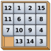
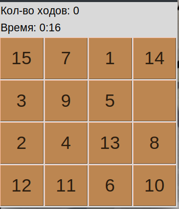
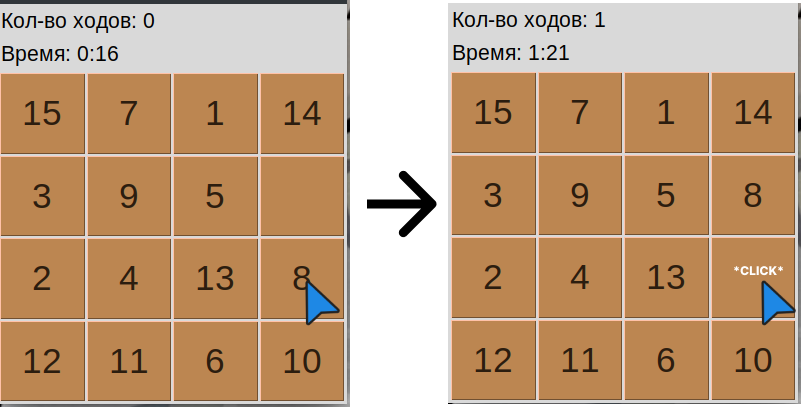
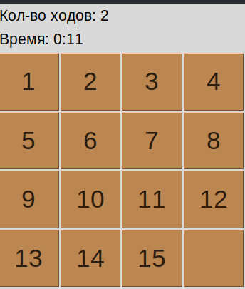
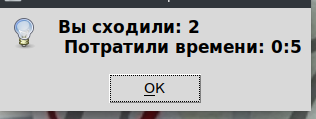

# Числовая головоломка "15"



## Описание

 Игровое поле размером 4x4 содержит плитки с числами от 1 до 15 и одну пустую клетку. Игрок должен перемещать плитки, чтобы упорядочить их по возрастанию, перемещая их на свободное место.



## Механики

Числа от 1 до 15 и пустая клетка поставлены в случайном порядке.
Игрок может перемещать клетки с помощью нажатие на клетку с числом, которая соседствует с пустой клеткой:



Так же во вверху окна показываеться количество пройденных ходов и потраченного времени.
Игрок сможет выйграть только тогда, когда все числа поставлены по порядку в возростание, а пустая клетка находиться в нижней правой клетке:



После победы, вылазет окно с информацией о потраченом времени и количестве ходов:



## Как запустить

Вы можете установить игру, скачав [файл установки](./dist/Setup.exe)

или

В начале убедитесь, что на ваш ПК установлен python версией не ниже 1.6
далее водите команды

```
git clone https://github.com/KirillMikhailov442/game15-py.git
cd game15-py/src
python main.py
```

## Команда

* Михайлов Кирилл - работа с двумерным массивов для хранения состояния игрового поля, ветвь: `Mikhailov-(two-dimensional-array)`
* Ковыляев Роман - работа с функцией для перемещения плиток, ветвь: `Kovylyaev-(functions-for-moving-tiles)`
* Бухарин Максим - работа с проверкой состояния игры, ветвь: `Buharin-(game-state-checks)`
* Лепихин Кирилл - работа с README.md файлом, ветвь: `Lepikhin-(README.md)`
